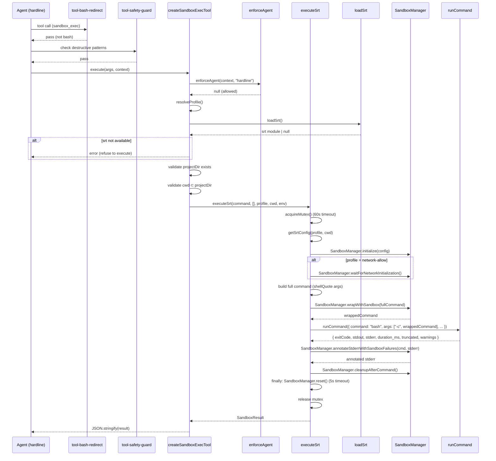
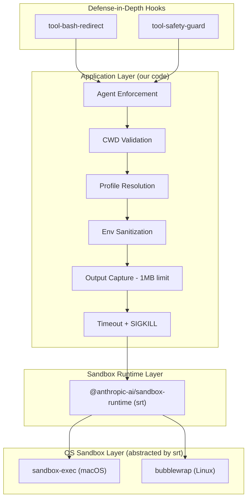
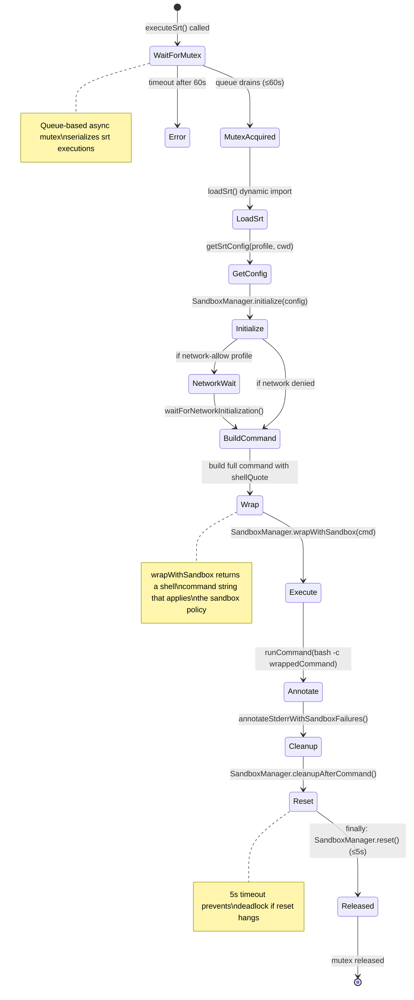

# Sandbox Architecture

The sandbox subsystem provides OS-level process isolation for shell command execution. It uses `@anthropic-ai/sandbox-runtime` (srt) as the sole sandboxing backend. The srt library internally handles platform-appropriate sandboxing mechanisms (sandbox-exec on macOS, bubblewrap on Linux), abstracting away platform differences and providing a unified API. The system is fail-closed — commands are never executed without sandbox protection.

## Core Components

```
src/tools/sandbox/
├── tool.ts              # createSandboxExecTool — main tool factory
├── profiles.ts          # SecurityProfile type, resolveProfile(), validateSandboxPath()
├── run-command.ts       # runCommand — process spawn, output capture, timeout
├── srt-loader.ts        # Dynamic import of @anthropic-ai/sandbox-runtime with caching
├── srt-config.ts        # Profile → SandboxRuntimeConfig mapping (nested config shape)
├── srt-executor.ts      # executeSrt — mutex, init/wrapWithSandbox/reset lifecycle
└── index.ts             # Barrel exports

src/hooks/
├── tool-safety-guard.ts # Defense-in-depth: destructive command patterns
└── tool-bash-redirect.ts# Redirects bash → sandbox_exec

src/tools/
└── agent-guard.ts       # enforceAgent — per-tool agent restriction
```

## Request Flow



## Security Profiles

Three profiles, controlled by `OPENCODE_SANDBOX_PROFILE` env var:

| Profile | Network | Filesystem | Use Case |
|---------|---------|-----------|----------|
| `default` | ❌ Denied | Read all, write project + /tmp | Standard code execution |
| `network-allow` | ✅ Allowed (github.com, gitlab.com, etc.) | Read all, write project + /tmp | Package install, API calls |
| `readonly` | ❌ Denied | Read-only everywhere | Safe inspection |

### Deny Rules (all profiles)

**Sensitive home paths denied (read):**
- `~/.ssh`, `~/.gnupg`, `~/.aws`, `~/.config/gcloud`, `~/.azure`
- `~/.kube`, `~/.docker`, `~/.netrc`, `~/.npmrc`, `~/.pypirc`
- `~/.git/config`

**Project .env files denied (read + write):**
- `.env`, `.env.local`, `.env.development`, `.env.production`, `.env.test`

### Profile Configuration

Profiles are mapped to `SandboxRuntimeConfig` in `srt-config.ts`:

```typescript
type SandboxRuntimeConfig = {
  network: {
    allowedDomains: string[];  // ["github.com", "*.github.com", "api.github.com", "raw.githubusercontent.com", "gitlab.com", "*.gitlab.com", "*.gitlab-static.net"] for network-allow, else []
    deniedDomains: string[];   // ["*"] for default/readonly, else []
  };
  filesystem: {
    denyRead: string[];        // sensitive paths (credentials, .env files)
    allowWrite: string[];      // [cwd, /tmp] for default/network-allow, [] for readonly
    denyWrite: string[];       // [] in all profiles
  };
};
```

The `getSrtConfig()` function builds this nested configuration structure from the profile name and working directory.

### Path Validation

`validateSandboxPath()` in `profiles.ts` checks paths for SBPL (Sandbox Profile Language) metacharacters as a defense-in-depth measure. Since srt generates SBPL profiles internally on macOS, this validation prevents injection attacks through crafted paths.

Rejected characters:
- `(` `)` — s-expression delimiters
- `#` — literal/regex prefix (e.g., `#"..."`)
- `;` — comment delimiter
- `\n` `\r` — could inject new SBPL lines or cause malformed profile parsing

## Architecture



The architecture is layered with clear separation of concerns:

- **srt** provides a unified API for OS-level sandbox policy (process isolation, filesystem restrictions, network filtering)
- **OS sandbox layer** (sandbox-exec on macOS, bubblewrap on Linux) enforces the security boundary at the kernel syscall level — managed transparently by srt
- **Our code** handles application-layer concerns on top: agent enforcement, output capture (1MB limit + UTF-8 truncation), timeout management (SIGKILL after 5s grace), cwd validation, env sanitization, profile resolution
- **Hooks** provide defense-in-depth regex patterns (trivially bypassable — documented as additive only)

The sandbox layer enforces the security boundary at the OS level through kernel syscall interception. The application layer adds additional safety checks and output handling that are independent of the underlying sandbox mechanism. By delegating platform-specific sandbox details to srt, our code remains platform-agnostic while still providing strong isolation guarantees.

## SRT Executor Lifecycle



Key constants (from `srt-executor.ts`):
- `MUTEX_TIMEOUT_MS = 60,000` ms (queue wait)
- `RESET_TIMEOUT_MS = 5,000` ms (cleanup deadline)

The lifecycle follows this pattern for every command execution:

1. **acquireMutex()** — Queue-based async mutex serializes srt operations
2. **loadSrt()** — Dynamic import of `@anthropic-ai/sandbox-runtime` (cached after first load)
3. **getSrtConfig()** — Build `SandboxRuntimeConfig` from profile + cwd
4. **SandboxManager.initialize()** — Set up proxies, bridges, and sandbox infrastructure
5. **waitForNetworkInitialization()** — Only for `network-allow` profile
6. **Build command** — Use `shellQuote()` to safely join command + args
7. **wrapWithSandbox()** — Returns a shell command string that applies the sandbox policy
8. **runCommand()** — Spawn `bash -c <wrappedCommand>`, capture output with 1MB limit
9. **annotateStderrWithSandboxFailures()** — Enrich stderr with sandbox diagnostic messages
10. **cleanupAfterCommand()** — Per-command cleanup
11. **finally: reset()** — Full cleanup with 5s timeout, then release mutex

The mutex ensures that only one srt execution can be active at a time. This prevents race conditions in the sandbox runtime initialization and cleanup. When multiple calls arrive concurrently, they form a queue. Each caller waits for the previous execution to complete (acquire the mutex), runs its command inside a fresh sandbox instance, then releases the mutex for the next caller.

The 5-second reset timeout is critical: if `SandboxManager.reset()` hangs indefinitely, the mutex would never be released and all subsequent sandbox calls would deadlock. The timeout ensures the system fails fast and surfaces the error rather than hanging silently.

### Per-Command Initialization

Each `executeSrt()` call goes through a complete `initialize → execute → reset` cycle. The sandbox is not persistent across commands. This design has important tradeoffs:

- ✅ **Isolation**: Each command starts with a clean slate, no state leakage between executions
- ✅ **Safety**: Bugs or hangs in one command don't affect subsequent commands
- ❌ **Performance**: Initialization overhead on every call (~100-500ms depending on profile)

The mutex serialization adds additional latency for concurrent calls, but is necessary to prevent race conditions in srt's internal state management.

## SandboxResult Type

```typescript
type SandboxResult = {
  exitCode: number | null;
  stdout: string;
  stderr: string;
  sandboxBackend: "srt";  // literal type, always "srt"
  profile: SecurityProfile;
  duration_ms: number;
  truncated: boolean;
  warnings: string[];
};
```

The `sandboxBackend` field is a literal type `"srt"` (not a union), reflecting that srt is the only backend.

## Output Handling

The output pipeline processes command stdout/stderr through multiple stages:

1. **stdout/stderr collected as Buffer chunks**
2. **Accumulation stops at `OUTPUT_LIMIT_BYTES` (1 MiB = 1,048,576 bytes)**
3. **`truncateUtf8()` trims to valid UTF-8 boundary (no broken multibyte chars)**
4. **`looksLikeBinary()` detects null bytes in first 8KB → replaces with `"<binary output, N bytes>"`**
5. **`formatOutput()` trims trailing whitespace**

Constants (from `run-command.ts`):
- `OUTPUT_LIMIT_BYTES = 1,048,576` (1 MiB)
- `KILL_GRACE_MS = 5,000` ms (grace period before SIGKILL)
- Default timeout: `30`s (hardcoded in `srt-executor.ts`)
- `MAX_TIMEOUT = 300`s (in `tool.ts`)

### UTF-8 Truncation

The `truncateUtf8()` function ensures that output truncation never splits a multi-byte UTF-8 character. UTF-8 uses 1-4 bytes per character. If truncation happens mid-character, the result would contain invalid UTF-8 sequences (U+FFFD replacement characters) that confuse the LLM.

The algorithm walks backward from the truncation point, skipping continuation bytes (10xxxxxx pattern), then verifies the leading byte's expected character length fits within the limit. This guarantees clean truncation at character boundaries.

### Binary Detection

The `looksLikeBinary()` heuristic scans the first 8KB for null bytes. Null bytes rarely appear in text files but are ubiquitous in binaries. If detected, the entire output is replaced with a size summary rather than sending corrupted/unprintable bytes to the LLM.

## Environment Sanitization

The env pipeline builds a clean environment for the sandbox child process (from `run-command.ts`):

1. **Start with `ALLOWED_BASE_ENV_VARS` from host process:**
   `PATH`, `HOME`, `USER`, `LANG`, `LC_ALL`, `TERM`, `SHELL`, `TMPDIR`, `NODE_ENV`
2. **Add user-provided env vars that pass validation:**
   - Key must match `/^[a-zA-Z_][a-zA-Z0-9_]*$/`
   - Values with null bytes (`\0`) are rejected
3. **Pass clean env to child spawn via `buildSandboxEnv()`**

The `buildSandboxEnv()` function is used by `runCommand()`, which is called from `executeSrt()` with the wrapped command string. All environment variable handling happens at the `runCommand()` layer, below the srt wrapper.

This approach prevents accidental leakage of host credentials through environment variables. The sandbox starts from a clean environment (no inherited vars except the allowed base set) and explicitly adds sanitized user vars.

### Security Note

The env sanitization rejects keys with invalid characters and values with null bytes, but **does NOT shell-escape values**. If the sandbox command string references env vars (e.g., `echo $USER_INPUT`), shell metacharacters in values can still cause injection. The sandbox profile (filesystem/network restrictions) is the primary defense layer. Callers should avoid constructing shell commands from env var values when possible.

## Hook Layer

### tool-bash-redirect
- Intercepts `bash` tool calls and throws error directing model to use `sandbox_exec`
- Necessary because SDK v2 deprecated `tools: { bash: false }` config
- Provides immediate feedback so the model learns on the first attempt

### tool-safety-guard
- Blocks destructive patterns: `rm -rf`, `git push --force`, `git reset --hard`, `DROP TABLE`, raw device writes, privilege escalation (`sudo`/`su`/`doas`/`pkexec`/`runuser`)
- Blocks reading secret files: `.env`, `.pem`, `.key`, `.p12`, `.pfx`, `.secret`, `.credentials`
- **Explicitly documented as defense-in-depth only** — trivially bypassable via subshells, backticks, variable expansion, full paths
- Primary defense is the OS-level sandbox policies enforced by srt

The hooks run before tool execution and can reject calls based on pattern matching. However, they should not be relied upon as a security boundary — a determined attacker can trivially bypass regex patterns. The real security comes from the OS-level sandbox policies enforced by srt (which internally uses SBPL on macOS and bubblewrap on Linux), intercepting syscalls at the kernel level.

### agent-guard
- `enforceAgent()` restricts `sandbox_exec` to the "hardline" agent only
- Returns JSON error if unauthorized agent calls the tool
- Prevents accidental sandbox usage from agents not designed for it

## Fail-Closed Design

The system refuses to execute in ALL of these scenarios:

1. **srt not available** (`loadSrt()` returns `null` — module not installed or import failed)
2. **srt initialization fails** (throws during `SandboxManager.initialize()`)
3. **cwd resolves outside project directory** (realpathSync validation in `tool.ts`)
4. **Project directory doesn't exist or isn't accessible** (fs.existsSync check in `tool.ts`)
5. **Invalid `OPENCODE_SANDBOX_PROFILE` value** (logs warning, falls back to `"default"`)
6. **Mutex timeout** (throws after 60s wait in queue)

In every failure case, the system returns a structured error rather than executing the command unsandboxed. This fail-closed design ensures that commands are never executed without proper isolation, even if the sandbox configuration is broken or missing.

The fail-closed principle is enforced at multiple layers:
- `tool.ts` validates project directory and cwd before calling `executeSrt()`
- `srt-loader.ts` returns `null` on import failure (no native fallback)
- `srt-executor.ts` throws on initialization/reset failures
- Mutex timeout throws after 60s to prevent indefinite hangs

This defense-in-depth approach ensures that even if one validation layer is bypassed, subsequent layers will still refuse execution.

### SRT as Hard Dependency

Unlike the previous dual-backend architecture, srt is now a **hard dependency** for sandboxed execution. If srt is not available or fails to initialize, the system **refuses to execute** rather than falling back to native OS sandboxes. This design trades availability for simplicity:

- ✅ **Simpler architecture**: Single code path, no fallback logic, no backend detection
- ✅ **Consistent behavior**: All executions use the same sandbox implementation
- ✅ **Better error messages**: srt provides rich diagnostic output via `annotateStderrWithSandboxFailures()`
- ❌ **Hard dependency**: Requires `@anthropic-ai/sandbox-runtime` to be installed

The srt library itself handles platform detection and delegates to the appropriate native sandbox (sandbox-exec on macOS, bubblewrap on Linux), so our code remains platform-agnostic.

## Dynamic Import Strategy

The srt module is loaded via dynamic import with caching (`srt-loader.ts`):

```typescript
let cached: typeof import("@anthropic-ai/sandbox-runtime") | null | undefined;

export async function loadSrt(): Promise<
  typeof import("@anthropic-ai/sandbox-runtime") | null
> {
  if (cached !== undefined) return cached;
  try {
    cached = await import("@anthropic-ai/sandbox-runtime");
    return cached;
  } catch {
    cached = null;
    return null;
  }
}
```

The `undefined` sentinel distinguishes "not yet loaded" from "tried to load and failed" (`null`). This avoids repeated import attempts on every command and provides clear error messages on first use. Although srt is a hard dependency, the dynamic import gracefully handles environments where the module cannot be loaded — sandbox execution will fail closed with a descriptive error.

## Tool Interface

The `createSandboxExecTool()` factory in `tool.ts` exposes this Zod schema:

```typescript
z.object({
  command: z.string().min(1).describe("Command to execute"),
  cwd: z.string().optional().describe("Working directory (relative to project root)"),
  env: z.record(z.string(), z.string()).optional().describe("Environment variables"),
  timeout: z.number().min(1).max(MAX_TIMEOUT).optional().describe("Timeout in seconds"),
})
```

The tool enforces agent restriction via `enforceAgent(context, "hardline", "sandbox_exec")`, ensuring only the hardline agent can call it.

The tool handler flow:

1. **enforceAgent()** — reject if caller is not hardline agent
2. **resolveProfile()** — read `OPENCODE_SANDBOX_PROFILE` env var (default: `"default"`)
3. **loadSrt()** — check srt available (fail closed if null)
4. **Validate project directory** — `realpathSync()` inside try/catch
5. **Validate cwd** — resolve relative path, check within project boundary
6. **executeSrt()** — direct call, no dispatch layer
7. **Return JSON** — `JSON.stringify(result, null, 2)`

All validation happens in `tool.ts` before delegating to `srt-executor.ts`. This ensures that `executeSrt()` can assume valid inputs and focus on the sandbox lifecycle.
